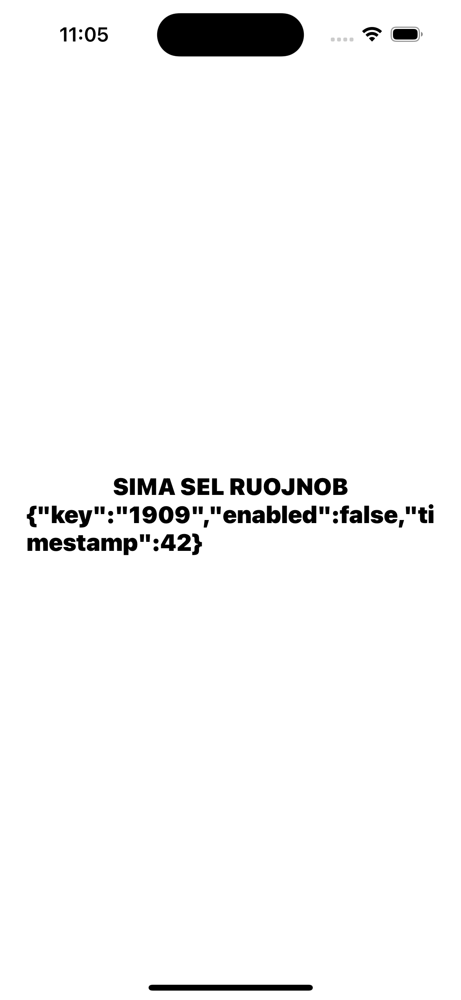
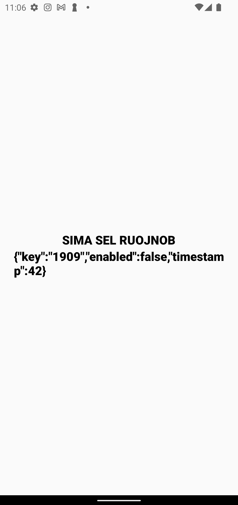
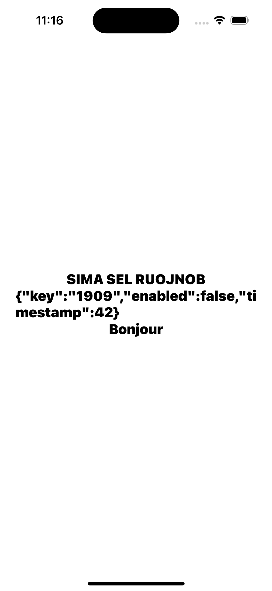

## Made using the official documentation:

https://reactnative.dev/docs/next/the-new-architecture/cxx-cxxturbomodules#3-module-registration
https://reactnative.dev/docs/next/the-new-architecture/cxx-custom-types

## Launch the app

1. Run `bun i`
2. Run `bunx expo run:ios` or `bunx expo run:android`

<!-- A table with 2 columns 2 rows -->

| iOS                        | Android                        |
| -------------------------- | ------------------------------ |
|  |  |

## Add a new method `getFrenchHello()`

Update `NativeSampleModule.ts`:

```diff
export interface Spec extends TurboModule {
  …
+  readonly getFrenchHello: () => string;
}
```

Update `NativeSampleModule.cpp`:

```diff
#include "NativeSampleModule.h"

namespace facebook::react {

…

+ std::string NativeSampleModule::getFrenchHello(jsi::Runtime& rt) {
+   return "Bonjour";
+ }

} // namespace facebook::react
```

Update `NativeSampleModule.h`:

```diff
…

namespace facebook::react {

…

class NativeSampleModule : public NativeSampleModuleCxxSpec<NativeSampleModule> {
 public:
  …

+   std::string getFrenchHello(jsi::Runtime& rt);
};

} // namespace facebook::react
```

Update `app/index.tsx`:

```diff
import React from "react";
import { StyleSheet, Text, View } from "react-native";
import NativeSampleModule from "../tm/NativeSampleModule";

export default function Page() {
  return (
    <View style={styles.container}>
      …

+       <Text style={styles.title}>{NativeSampleModule.getFrenchHello()}</Text>
    </View>
  );
}

…

```

Then run `bunx expo run:ios` or `bunx expo run:android`




## Notes

When renaming `NativeSample`, you must use a name with the following structure `NativeXXXXX`, otherwise it won't work 🤷‍♂️
